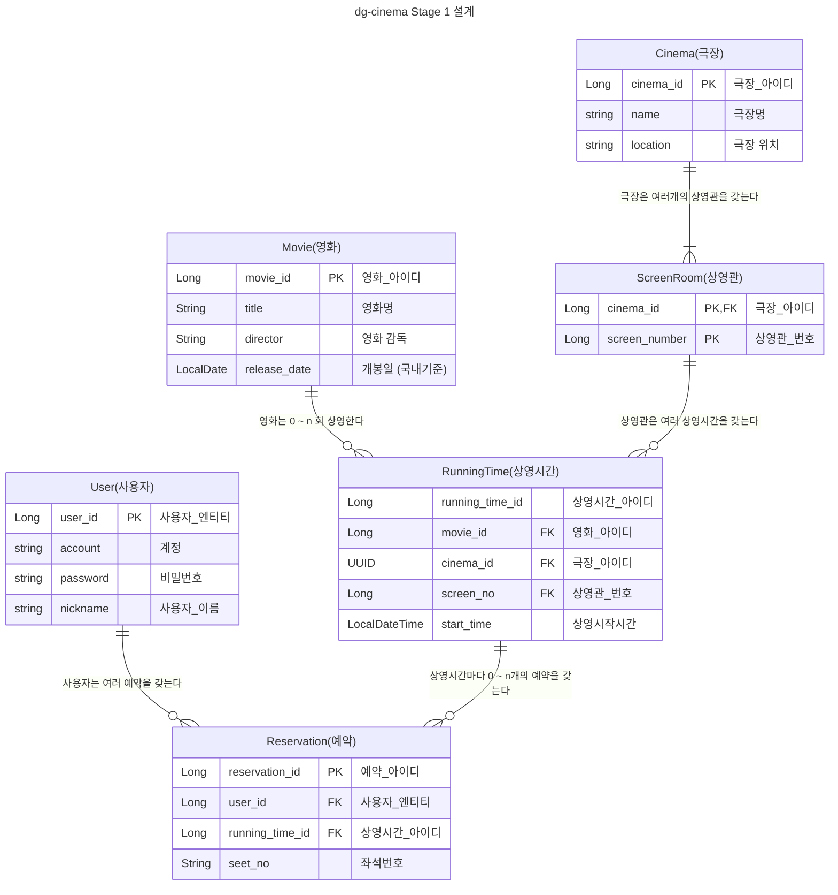

# Entity 설계

## Stage 1: 기본 기능



### 제약 사항

- 상영관 명은 번호로만 관리합니다 (1번 상영관, 2번 상영관 ...)
- 상영관 좌석은 상영관별 특성을 반영하지 않습니다. (일괄 A행 ~ H행, 1열 ~ 12열까지 있습니다. 8 * 12개의 좌석)
- 상영관 좌석은 차등가격제도를 이용하지 않습니다. (일괄 10,000원으로 설정합니다.)
- 예약 1건당 하나의 좌석에 대해 처리합니다. (한 사람이 여러장을 예약할 경우, n 건의 예약 row가 발생합니다.)
- **제일중요** : 해당 설계는 초안이며, 의견, 코드리뷰에 따라 수정할 수 있습니다.

## 기타

### H2 DB에서 schema 확인시

```sql
select TABLE_NAME, COLUMN_NAME, DATA_TYPE, CHARACTER_MAXIMUM_LENGTH as LENGTH, COLUMN_DEFAULT, REMARKS
from INFORMATION_SCHEMA.COLUMNS
where TABLE_SCHEMA = 'PUBLIC';
```
